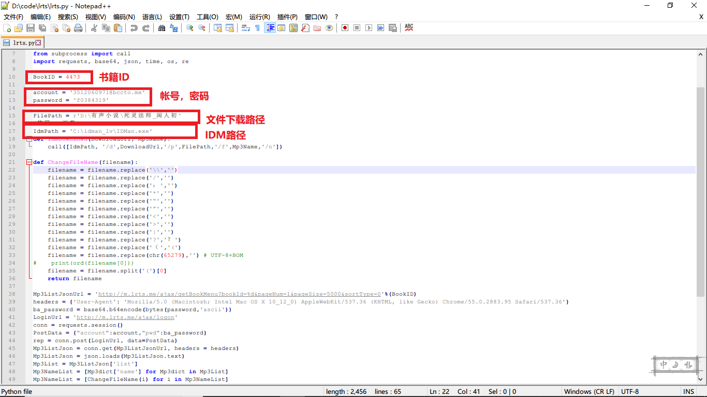
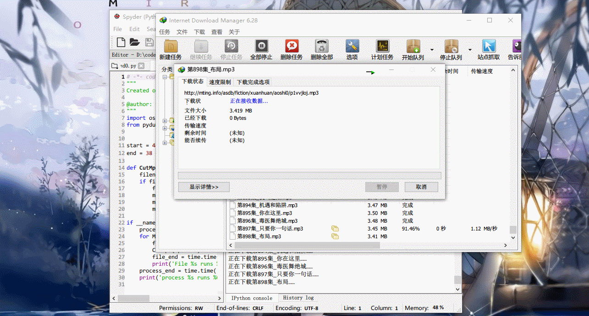

# 懒人听书下载

#### 嘤嘤嘤

由于淘宝2块钱可以买到60听书券，针对此可重构代码：

1.淘宝购买帐号密码后登陆懒人听书网页，自行购买书籍；

2.设置完毕后运行，下载免费内容+该帐号已购买内容；

3.若无已购买内容，仅下载该书籍**免费部分**；

##### 注：

多帐号操作：

某小说共有400集，其中1-200集为免费收听，300-400为付费章节。

可操作方式：A帐号购买 200-300集，B帐号购买300-400集。将A帐号密码输入后运行，下载1-300集，然后切换为B帐号继续下载300-400集，会自动跳过已下载章节（基于已下载文件夹）。

---

#### 说明

逐个抓取懒人听书链接并**直接下载**，登录帐号密码后**可下载已购买内容**。

需设置内容：

书籍ID、帐号密码、文件下载路径、IDM路径、IDM下载时间间隔（time.sleep）。

